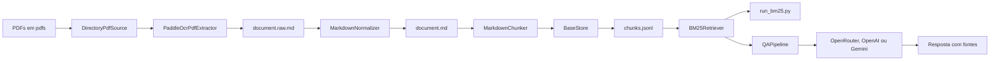

# Arquitetura do sistema

## Objetivo

O Oráculo é um sistema RAG para documentos PDF. Ele transforma documentos em
chunks pesquisáveis, recupera os trechos lexicalmente mais relevantes com BM25+
e pode fornecer esses trechos a uma LLM para produzir uma resposta fundamentada.

O sistema separa ingestão, recuperação e geração. Assim, é possível testar o
BM25 sem chave de API e trocar o provedor de LLM sem reprocessar os PDFs.

## Visão de componentes



## Camadas

| Camada | Componentes | Responsabilidade |
| --- | --- | --- |
| Entrada | `DirectoryPdfSource` | Descobrir PDFs e criar metadados básicos |
| Extração | `PaddleOcrPdfExtractor` | Reconhecer texto e preservar divisões de página |
| Normalização | `MarkdownNormalizer` | Uniformizar Unicode, quebras de linha e espaços |
| Chunking | `MarkdownChunker` | Criar trechos por estrutura e limite de tokens |
| Persistência | `BaseStore` | Manter snapshots JSONL e artefatos por documento |
| Recuperação | `BM25Retriever` | Carregar o JSONL e ranquear trechos lexicalmente |
| Geração | `QAPipeline` e provedores | Montar contexto e solicitar uma resposta à LLM |
| CLI | `src.cli.ingest`, `run_bm25.py`, `run_qa.py` | Expor os fluxos pelo terminal |

## Estrutura relevante do repositório

```text
Oraculo/
├── configs/
│   ├── ingestion.example.yml
│   └── ingestion.yml
├── data/
│   └── bases/
│       └── documentos/
├── docs/
├── pdfs/
├── src/
│   ├── cli/
│   │   └── ingest.py
│   ├── ingestion/
│   │   ├── chunkers.py
│   │   ├── config.py
│   │   ├── extractors.py
│   │   ├── models.py
│   │   ├── normalizers.py
│   │   ├── pipeline.py
│   │   ├── sources.py
│   │   └── storage.py
│   ├── llm/
│   ├── pipelines/
│   │   └── qa.py
│   └── retrievers/
│       └── bm25.py
├── read_pdf.py
├── run_bm25.py
└── run_qa.py
```

## Fluxo de ingestão

1. A configuração YAML é lida e validada.
2. `DirectoryPdfSource` descobre arquivos com extensão `.pdf`, sem diferenciar
   maiúsculas e minúsculas.
3. A pipeline calcula SHA-256 do arquivo.
4. Um PDF com checksum já registrado é ignorado, salvo quando `force` está ativo.
5. PaddleOCR reconhece as páginas e filtra linhas abaixo da confiança mínima.
6. As páginas são unidas pelo marcador `<!-- page-break -->`.
7. O Markdown é normalizado.
8. O chunker respeita títulos Markdown, páginas, tabelas e limites de tokens.
9. Os artefatos são preparados em `.staging`.
10. A versão válida é movida para `documents/<document_id>`.
11. Metadados e chunks são gravados atomicamente em JSONL.

## Fluxo de consulta

1. `BM25Retriever.from_jsonl` carrega `chunks.jsonl`.
2. O campo `text` de cada chunk é convertido em termos lexicais Unicode com
   `casefold`.
3. A pergunta passa pela mesma tokenização lexical.
4. Chunks sem qualquer termo em comum são descartados.
5. BM25+ calcula o score e ordena os candidatos.
6. `run_bm25.py` exibe os resultados diretamente, ou `QAPipeline` monta um
   contexto com fonte e páginas.
7. A LLM recebe o contexto, a pergunta e a instrução de não extrapolar os dados.

## Identidade e atualização de documentos

O checksum é SHA-256 do conteúdo do PDF. O identificador do documento é formado
a partir do caminho relativo e do checksum, truncado para 24 caracteres. O
identificador de chunk combina documento, posição e texto, truncado para 32
caracteres.

Quando um PDF muda, uma nova versão é processada primeiro. A versão anterior só
é substituída após extração, normalização e chunking bem-sucedidos. Se houver
falha, a última versão válida permanece disponível.

## Escrita atômica

O armazenamento grava metadados em arquivos temporários no mesmo diretório,
sincroniza o conteúdo e executa uma substituição atômica. Artefatos de documentos
são preparados em `.staging`. Essa estratégia reduz o risco de deixar uma base
parcial após uma interrupção.

## Limitações arquiteturais atuais

- O índice BM25 é reconstruído em memória a cada execução.
- A busca BM25 é lexical; perguntas sem termos em comum dependem dos modos
  `vector` ou `hybrid` (ver [BUSCA_VETORIAL.md](BUSCA_VETORIAL.md)).
- Não há API HTTP ou interface web.
- Não há autenticação na aplicação de linha de comando.
- MinIO está disponível no Docker Compose, mas não é fonte da ingestão.
- Remover um PDF de `pdfs/` não remove o documento correspondente da base.
