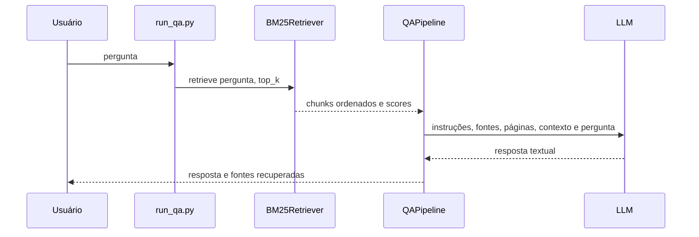

# Busca BM25 e RAG

## Conceitos

O sistema possui dois modos de consulta:

- BM25 local: recupera trechos e exibe scores, sem chamar uma API;
- RAG completo: recupera os trechos com BM25 e solicita a uma LLM uma resposta
  baseada nesses trechos.

Ambos leem, por padrão:

```text
data/bases/documentos/chunks.jsonl
```

## Tokenização da busca

A contagem de tamanho dos chunks durante a ingestão usa `tiktoken`. A busca BM25
usa uma tokenização lexical separada e apropriada para recuperação:

1. aplica `casefold` ao texto;
2. extrai sequências Unicode reconhecidas por `\w+`;
3. mantém números e palavras acentuadas;
4. cria uma lista de termos por chunk.

Isso significa que `Flutter` e `flutter` são equivalentes. A busca permanece
lexical: termos sem sobreposição, mesmo semanticamente parecidos, não recebem
correspondência automática.

## BM25+

O retriever utiliza `BM25Plus` da biblioteca `rank-bm25`. BM25+ pertence à
família BM25 e evita scores degenerados em coleções muito pequenas, como uma
base com apenas dois chunks.

Antes de ranquear, o retriever remove chunks sem qualquer termo em comum com a
pergunta. Não existe um threshold absoluto fixo. Os candidatos são ordenados por
score decrescente e limitados por `top_k`.

O índice é criado em memória sempre que o script inicia. O JSONL não precisa
armazenar tokens do BM25.

## Testar somente o BM25

Consulta como argumento:

```bash
python run_bm25.py "Como executar o aplicativo Flutter?"
```

Modo interativo:

```bash
python run_bm25.py
```

Opções:

| Opção | Padrão | Descrição |
| --- | --- | --- |
| `question` | interativo | Pergunta a pesquisar |
| `--chunks` | `data/bases/documentos/chunks.jsonl` | Outra base JSONL |
| `--top-k` | `3` | Máximo de resultados |
| `--full` | desativado | Exibe o texto integral |

Exemplos:

```bash
python run_bm25.py "Como funciona a sincronização offline?" --top-k 5
python run_bm25.py "Quais são os pré-requisitos?" --full
python run_bm25.py "Minha pergunta" --chunks data/bases/manuais/chunks.jsonl
```

Para cada resultado, o script mostra:

- posição no ranking;
- score BM25;
- PDF de origem;
- intervalo de páginas;
- até 500 caracteres do texto, salvo quando `--full` estiver ativo.

Se nenhum chunk compartilhar termos com a pergunta, o script informa que nenhum
trecho relacionado foi encontrado.

## RAG completo

Fluxo:



Execução padrão com OpenRouter:

```bash
python run_qa.py "Como executar o aplicativo?"
```

Outros provedores:

```bash
python run_qa.py "Minha pergunta" --provider openai --model gpt-4.1-mini
python run_qa.py "Minha pergunta" --provider gemini --model gemini-2.0-flash
```

Opções:

| Opção | Padrão | Descrição |
| --- | --- | --- |
| `question` | interativo | Pergunta enviada ao RAG |
| `--chunks` | base `documentos` | Arquivo JSONL consultado |
| `--provider` | `openrouter` | `openrouter`, `openai` ou `gemini` |
| `--model` | depende do provedor | Modelo usado para geração |
| `--top-k` | `3` | Número máximo de chunks no contexto |

Modelos padrão definidos no script:

| Provedor | Modelo padrão | Variável de chave |
| --- | --- | --- |
| OpenRouter | `openai/gpt-4.1-mini` | `OPENROUTER_API_KEY` |
| OpenAI | `gpt-4.1-mini` | `OPENAI_API_KEY` |
| Gemini | `gemini-2.0-flash` | `GEMINI_API_KEY` |

`LLM_PROVIDER` e `LLM_MODEL` podem alterar os padrões. Argumentos da linha de
comando têm precedência.

## Construção do prompt

`QAPipeline` adiciona a cada trecho:

- nome do documento;
- páginas inicial e final;
- texto do chunk.

A instrução pede que a LLM:

- use exclusivamente o contexto recuperado;
- informe quando a resposta não estiver no contexto;
- responda diretamente;
- cite o nome do documento utilizado.

Se o BM25 não retornar resultados, a pipeline devolve uma resposta local e não
chama a LLM. Isso evita gasto de API para perguntas sem correspondência lexical.

## Interpretação dos scores

O score serve para ordenar resultados dentro da mesma consulta e da mesma base.
Ele não representa probabilidade e não deve ser interpretado como porcentagem.
O valor pode mudar quando documentos ou chunks são adicionados, porque as
estatísticas do corpus mudam.

## Escolha de `top_k`

- Valores pequenos reduzem custo e ruído no prompt.
- Valores maiores aumentam cobertura, mas podem adicionar contexto irrelevante.
- O padrão 3 é um ponto inicial; avalie com perguntas representativas da base.

## Limitações da recuperação

- Não há stemming ou lematização em português.
- Não há lista de stopwords.
- Não há expansão de sinônimos.
- Não há reranking semântico.
- Não há filtros por documento ou metadados na CLI.
- Todo o corpus é carregado e indexado em memória.

Para diagnosticar qualidade de recuperação, use primeiro `run_bm25.py`. Só
depois avalie a resposta da LLM, separando erros de busca de erros de geração.
