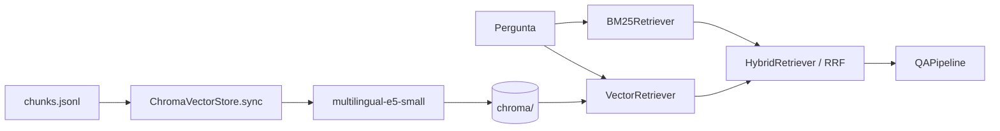

# Banco vetorial e busca semântica

## Por que um banco vetorial

O BM25 só encontra trechos que compartilham palavras com a pergunta. Uma
pergunta como "quem são os usuários do sistema?" não encontra um trecho que fala
de "agentes de saúde que visitam famílias", porque nenhum termo coincide.

A busca vetorial converte a pergunta e cada chunk em vetores (embeddings) que
representam o significado do texto. Trechos com sentido parecido ficam próximos
no espaço vetorial, mesmo sem palavras em comum.

## Componentes

| Componente | Arquivo | Responsabilidade |
| --- | --- | --- |
| `SentenceTransformerEmbedder` | `src/retrievers/embeddings.py` | Gera embeddings normalizados |
| `ChromaVectorStore` | `src/retrievers/vector.py` | Mantém o índice ChromaDB sincronizado com `chunks.jsonl` |
| `VectorRetriever` | `src/retrievers/vector.py` | Busca por similaridade de cosseno |
| `HybridRetriever` | `src/retrievers/hybrid.py` | Combina BM25 e vetores com Reciprocal Rank Fusion |
| `build_retriever` | `src/retrievers/factory.py` | Cria o retriever do modo escolhido |
| CLI de indexação | `src/cli/index_vectors.py` | Vetoriza uma base já ingerida |



## Onde os vetores ficam

```text
data/bases/documentos/
├── chunks.jsonl        # fonte da verdade (texto e metadados)
└── chroma/             # índice vetorial persistente do ChromaDB
```

O `chunks.jsonl` continua sendo a fonte da verdade. A pasta `chroma/` é
derivada dele e pode ser apagada e recriada a qualquer momento. Por isso ela
está no `.gitignore`.

Cada registro no ChromaDB guarda:

- `id`: o mesmo `chunk_id` do JSONL;
- `embedding`: vetor do texto do chunk precedido dos títulos da seção;
- `document`: texto do chunk;
- metadados: `document_id`, `chunk_index`, `source_path`, `page_start`,
  `page_end`, `token_count` e `section_path` (JSON).

## Modelo de embeddings

O padrão é `intfloat/multilingual-e5-small` (384 dimensões, ~470 MB), treinado
para recuperação em vários idiomas, incluindo português. Os prefixos
`query: ` e `passage: ` exigidos pela família E5 são aplicados automaticamente.

Os scores de similaridade do E5 ficam concentrados perto de 0,8. O que importa é
a ordem dos resultados, não o valor absoluto.

O nome do modelo é gravado na coleção. Se o modelo configurado mudar, o índice é
recriado automaticamente, porque vetores de modelos diferentes não são
comparáveis.

Na primeira execução o modelo é baixado do Hugging Face. Se a rede usar um
proxy/antivírus que intercepta HTTPS (erro `CERTIFICATE_VERIFY_FAILED`), baixe o
modelo em outra rede ou configure o certificado. Depois do download, é possível
trabalhar offline com `HF_HUB_OFFLINE=1`.

## Indexação

### Automática, na ingestão

Com `vector_store.enabled: true` (padrão), a ingestão atualiza o índice ao final:

```bash
python -m src.cli.ingest --config configs/ingestion.yml
```

Configuração em `configs/ingestion.yml`:

```yaml
vector_store:
  enabled: true
  embedding_model: intfloat/multilingual-e5-small
  device: cpu        # ou cuda
  batch_size: 32
```

Se a vetorização falhar, a ingestão não é perdida: o JSONL é gravado normalmente
e o erro aparece em `vector_index` no resumo.

### Manual, para uma base existente

```bash
python -m src.cli.index_vectors
python -m src.cli.index_vectors --base-dir data/bases/outra-base
python -m src.cli.index_vectors --rebuild              # apaga e refaz tudo
python -m src.cli.index_vectors --model intfloat/multilingual-e5-base
```

### Sincronização incremental

O `chunk_id` é um hash do documento, da posição e do texto. A sincronização
compara os IDs do JSONL com os do índice:

- IDs novos são vetorizados e inseridos;
- IDs que não existem mais no JSONL são removidos;
- IDs iguais são mantidos sem recalcular embeddings.

Assim, reprocessar a base só vetoriza os PDFs que mudaram.

## Modos de busca

| Modo | Como funciona | Quando usar |
| --- | --- | --- |
| `bm25` | Palavras em comum (BM25+) | Termos exatos, códigos, nomes |
| `vector` | Similaridade semântica | Perguntas com outras palavras |
| `hybrid` | BM25 + vetores via RRF | Padrão recomendado |

O modo híbrido usa Reciprocal Rank Fusion: cada retriever devolve até 20
candidatos e cada chunk recebe `1 / (60 + posição)` por ranking em que aparece.
Como só a posição é usada, não é preciso normalizar scores de escalas
diferentes. Na saída, `scores` mostra o score original de cada retriever.

Documentos marcados como removidos no SQLite são filtrados também na busca
vetorial (`where document_id in ...`).

## Testar a busca sem LLM

```bash
python run_search.py "Quem são os usuários do sistema?"
python run_search.py "Como rodar o projeto?" --retriever vector --top-k 5
python run_search.py "flutter run" --retriever bm25 --full
```

## RAG com o modo escolhido

```bash
python run_qa.py "Como funciona a sincronização?"               # hybrid
python run_qa.py "Como funciona a sincronização?" --retriever vector
```

Variáveis no `.env` (usadas por `run_qa.py`, `run_search.py` e pela API):

```text
RETRIEVER_MODE=hybrid
EMBEDDING_MODEL=intfloat/multilingual-e5-small
```

A API (`POST /ask`) usa `RETRIEVER_MODE` e `EMBEDDING_MODEL`. O modelo é
carregado uma vez por processo e reaproveitado entre requisições.

## Como usar o ChromaDB

### Uso pelo projeto (dia a dia)

No uso normal não é preciso manipular o ChromaDB diretamente; os comandos do
projeto criam, atualizam e consultam o banco:

```bash
# 1. Ingestão: lê os PDFs, cria os chunks e grava os vetores no ChromaDB
python -m src.cli.ingest --config configs/ingestion.yml

# 2. (Opcional) Revetorizar uma base existente
python -m src.cli.index_vectors             # só o que mudou
python -m src.cli.index_vectors --rebuild   # apaga e refaz tudo

# 3. Testar a busca sem gastar API
python run_search.py "Como rodar o projeto?"                     # híbrida
python run_search.py "Como rodar o projeto?" --retriever vector  # só vetorial

# 4. Perguntar com a LLM
python run_qa.py "Como funciona a sincronização?"
```

O ChromaDB é usado em modo embutido: não é um servidor, são arquivos locais em
`data/bases/documentos/chroma/` (semelhante ao SQLite). Não é necessário Docker
nem nenhum serviço em execução.

### Conceitos

| Conceito | O que é | No projeto |
| --- | --- | --- |
| Client | Conexão com o banco (uma pasta no disco) | `PersistentClient(path=".../chroma")` |
| Collection | Equivalente a uma tabela | `chunks` |
| id | Identificador único de cada item | `chunk_id` |
| embedding | Vetor que representa o significado do texto | 384 números do `multilingual-e5-small` |
| document | Texto original | Texto do chunk |
| metadata | Campos extras, usáveis como filtro | `source_path`, `page_start`, `document_id`... |

### Inspecionar o banco com Python

Crie um arquivo `explorar_chroma.py` na raiz do projeto:

```python
import chromadb
from src.retrievers import SentenceTransformerEmbedder

client = chromadb.PersistentClient(path="data/bases/documentos/chroma")

# Listar coleções
print(client.list_collections())

col = client.get_collection("chunks")
print("Total de chunks:", col.count())

# Ver alguns registros
dados = col.get(limit=3, include=["documents", "metadatas"])
for id_, texto, meta in zip(dados["ids"], dados["documents"], dados["metadatas"]):
    print(id_, meta["source_path"], meta.get("page_start"), texto[:80])

# Busca semântica: a pergunta precisa virar vetor com O MESMO modelo do índice
embedder = SentenceTransformerEmbedder("intfloat/multilingual-e5-small")
vetor = embedder.embed_query("Como rodar o projeto?")

resultado = col.query(
    query_embeddings=[vetor],
    n_results=3,
    # where={"source_path": "manual.pdf"},  # filtro opcional por metadado
)
for texto, dist in zip(resultado["documents"][0], resultado["distances"][0]):
    print(f"similaridade={1 - dist:.3f}  {texto[:100]}")
```

Execute com:

```bash
python explorar_chroma.py
```

A coleção foi criada sem função de embedding própria, pois os vetores são
calculados pelo projeto. Por isso, consulte sempre com `query_embeddings`
gerados pelo mesmo modelo; `query_texts` não funciona nessa coleção.

### Operações básicas (referência)

```python
col.add(ids=["x1"], embeddings=[vetor], documents=["texto"], metadatas=[{"fonte": "a.pdf"}])
col.get(ids=["x1"])                                  # buscar por id
col.get(where={"document_id": "abc123"})             # filtrar por metadado
col.update(ids=["x1"], metadatas=[{"fonte": "b.pdf"}])
col.delete(ids=["x1"])
col.delete(where={"document_id": "abc123"})
client.delete_collection("chunks")                   # apaga a coleção inteira
```

Operadores aceitos em `where`: `$eq`, `$ne`, `$gt`, `$gte`, `$lt`, `$lte`,
`$in`, `$nin`, `$and` e `$or`. Exemplo: `{"page_start": {"$gte": 3}}`.

### Boas práticas

- Não edite o banco manualmente no uso normal: ele é derivado do
  `chunks.jsonl` e mantido sincronizado por `index_vectors` e pela ingestão.
  Se algo sair do esperado, rode `python -m src.cli.index_vectors --rebuild`.
- Para trocar o modelo de embeddings, altere `vector_store.embedding_model` em
  `configs/ingestion.yml` e `EMBEDDING_MODEL` no `.env`; o índice é recriado
  automaticamente.

## Limitações

- No modo `vector`, sempre há resultados (os mais próximos), mesmo para
  perguntas fora do assunto; a LLM é quem informa que não encontrou a resposta.
- Os modos `vector` e `hybrid` exigem que o índice exista; caso contrário, uma
  mensagem pede para rodar `python -m src.cli.index_vectors`.
- O E5-small é rápido em CPU, mas modelos maiores (`multilingual-e5-base`)
  tendem a ranquear melhor. Trocar o modelo exige reindexar (feito
  automaticamente).
